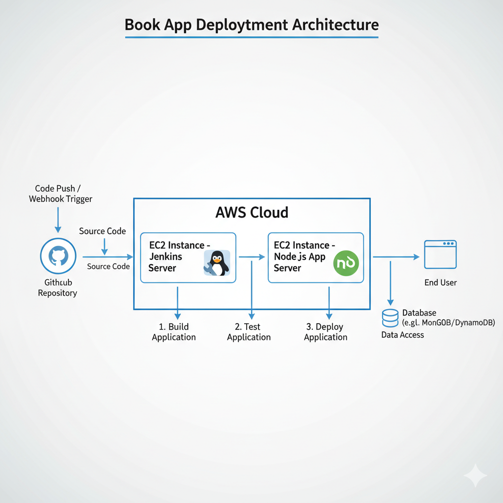
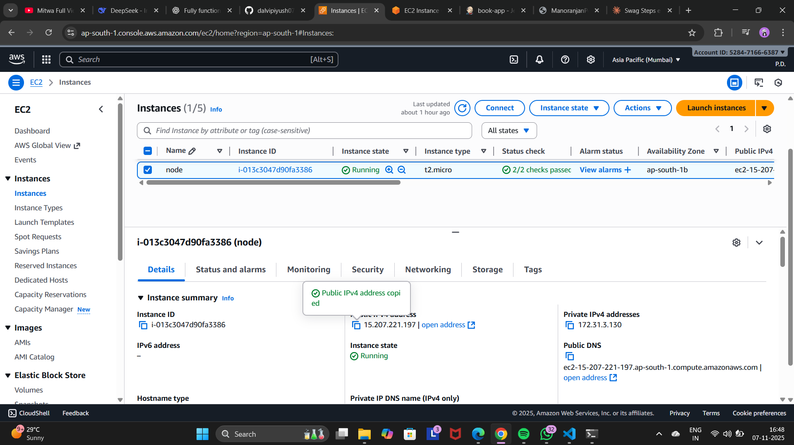
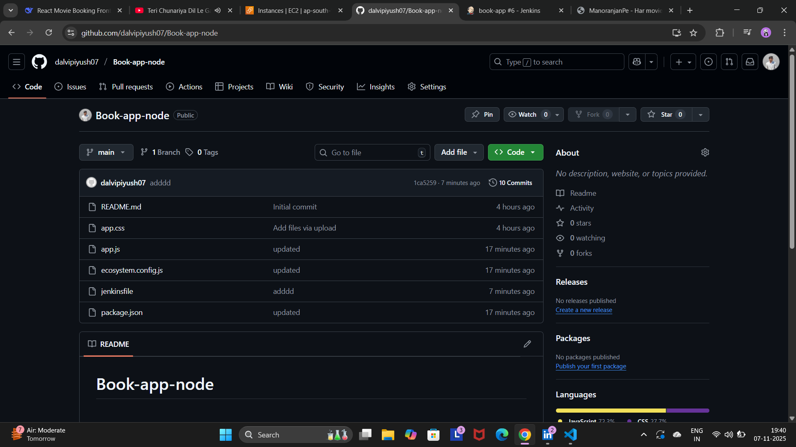
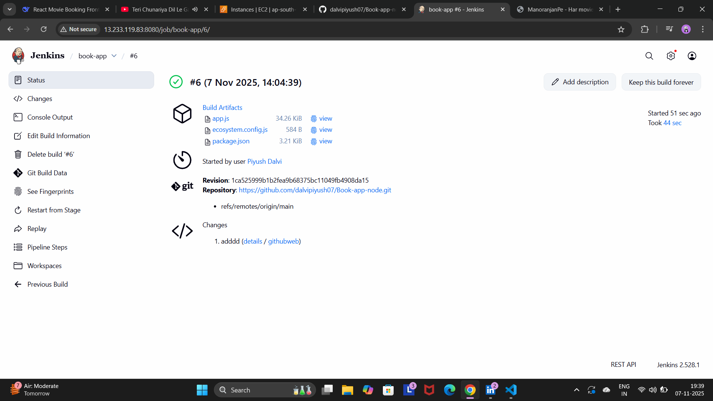
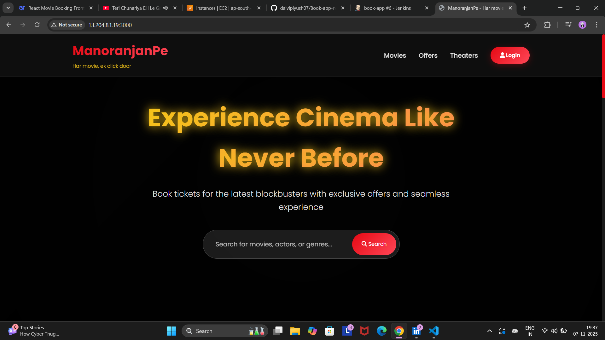

# Book App CI/CD Implementation Guide (Jenkins + AWS EC2)

 ## Project Overview

This document outlines the complete setup and deployment process for a Book App Node.js application using AWS EC2, Jenkins, and GitHub.



## 1. EC2 Instance Setup

 ### Instance 
 ```bash
 Instance Name: node

Instance ID: I-013c3047d90fa3386

Instance State: Running

Instance Type: t2.micro

Availability Zone: ap-south-1b

Public IPv4: 15.207.221.197

Private IPv4: 172.31.3.130

Public DNS: ec2-15-207-221-197.ap-south-1.compute.amazonaws.com

Security Group : 22,80,8080,3000.
```


## 2.Jenkins Installation & Setup 

```bash
sudo hostnamectl hostname jenkins

exit

ssh -i <source>

sudo apt update

clear

sudo apt install openjdk-17-jdk -y

https://www.jenkins.io/doc/book/installing/linux/#debianubuntu

```
## 3.Node.js Installation

### Installation Steps

```bash
sudo apt update

sudo apt install nodejs npm -y 

sudo npm install -g pm2

```
## 4.Push to Github

### code push from Local to Github


## 5.GitHub Setup

### Repository Information
```bash
Repository: Book-app-node

URL: https://github.com/dabirbyush07/Book-app-node.git

Main Branch: main

Latest Commit: 1ca529999b1b2fead968375bc11049bb608da15
```


## 6.Jenkins Pipeline Setup

### Configuration Steps
```bash
Create New Jenkins Item

Item type: Pipeline

Name: book-app

Pipeline Configuration

Definition: Pipeline script from SCM

SCM: Git

Repository URL: https://github.com/dabirbyush07/Book-app-node.git

Branch: main

Script Path: Jenkinsfile (if exists)

Build Triggers (Optional)

GitHub hook trigger for GITScm polling

Poll SCM

Build periodically
```


### Build Process

**The pipeline automatically:**

Clones the repository

Installs dependencies

Runs tests (if configured)

Deploys the application

Manages the application with PM2

## 7.Success Metrics

### Build #6 Details (7 Nov 2025, 14:04:39)

```bash
Status: ✅ Successful

Duration: 44 seconds

Started By: User Piyush Dahl

Artifacts Generated:

app.js (34.26 KB)

ecosystem.config.js (584 B)

package.json (3.21 KB)

View directory
```


## 8.🚀 Application Deployment

### Deployed Application Features

Movie Booking Platform

Search functionality for movies, actors, or genres

Seamless user experience

Exclusive offers and promotion



## Security Considerations

1.EC2 Security Groups properly configured

2.Regular updates for Node.js and dependencies

3.PM2 for process management and auto-restart

4.Jenkins security with user authentication

## Success Criteria Met

EC2 instance provisioned and running

Node.js successfully installed

GitHub repository configured

Jenkins pipeline set up and functional

Successful build and deployment

Application accessible and functional

Automated deployment process established

